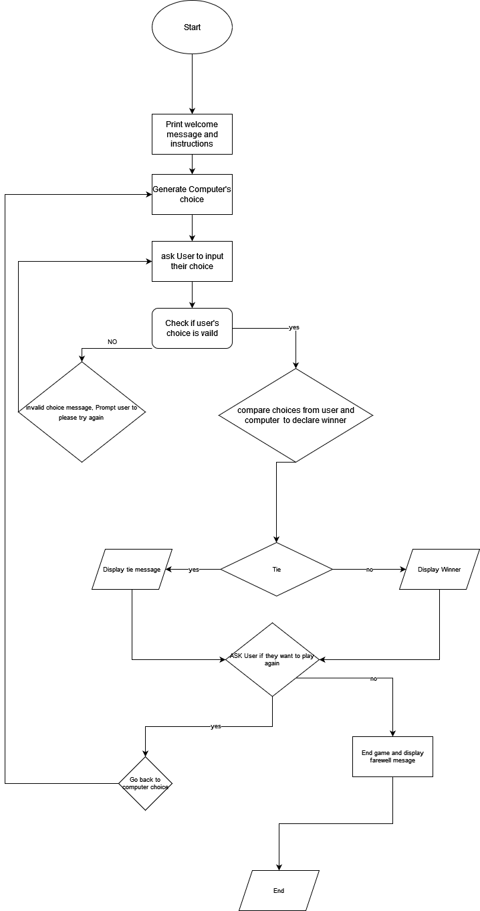

# Group-Lab

## Rock, Paper, Scissors Game

### Algorithmic Standpoint
**Instructions**

1.	The game is played between two players: the user and the computer.
2.	Each player chooses one of the three options: rock, paper, or scissors.
3.	The game is won by the player who selects an option that beats the option selected by the other player.
4.	If both players select the same option, it's a tie, and the game is played again.

 
 

**Algorithm**
1.	Start the game by displaying a welcome message to the players.
2.	Provide instructions on how to play the game.
3.	Randomly generate a choice for the computer (rock, paper, or scissors).
4.	Prompt the user to input their choice (rock, paper, or scissors).
5.	Check if the user's choice is valid, i.e., if it's one of the three options.
6.	If the user's choice is not valid, display an error message and prompt the user to try again.
7.	If the user's choice is valid, compare the user's choice with the computer's choice using the following rules: a. Rock beats scissors b. Paper beats rock c. Scissors beats paper
8.	Display the results of the game: a. If both players select the same option, display a tie message. b. If the user wins, display a message indicating that the user won. c. If the computer wins, display a message indicating that the computer won.
9.	Ask the user if they want to play again.
10.	If the user wants to play again, go back to step 3.
11.	If the user doesn't want to play again, end the game by displaying a farewell message.

### Roles and Responsibilities
We are a group of two. Shefayen is responsible for app developing and Kasher is a QA Tester. However, it doesn't mean that we didn't help each other. In other words, we worked on this project side by side regardless of our actual role.

 
 

### Game Flowchart

 

 

 Rock, Paper, Scissors Game Flowchart

